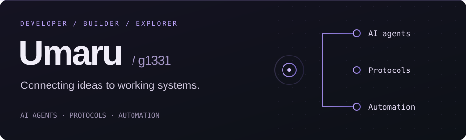

  

I build tools that connect AI to practical workflows — from model routing and MCP servers to automotive configuration and chat bots. Currently exploring Rust through hands-on projects.

[Explore my repositories](https://github.com/g1331?tab=repositories) · [My stack & discoveries](https://github.com/g1331?tab=stars)

## Tools & interests

- **Languages:** Python · TypeScript · Rust · C#
- **AI & tooling:** AI agents · Model Context Protocol · OpenAI · Claude
- **Protocols & systems:** AUTOSAR · CAN / DBC · ZeroMQ · Satori / OneBot
- **Application development:** Tauri · Node.js · Chat bots · Automation

## On GitHub

<!-- Generated daily by .github/workflows/profile-stats.yml. Failed updates keep the last successful cards. -->

  
  

