<!-- 顶部：动态打字效果，精准描述你的三个核心身份 -->

  

  <h3>🤖 AI Agent Developer | 🔌 Protocol Engineer | 🦀 Rust Learner</h3>

 

<!-- 统计卡片由 GitHub Actions 每日生成；失败时保留上次成功的图片。 -->

  
  

 

<!-- 技术栈：根据你的实际仓库定制 -->

  <h3>🛠️ Technical Arsenal</h3>
  
  <!-- 第一行：核心语言 -->
  

    
    
    
    
  

  
   
  
  <!-- 第二行：AI & MCP (你的重点领域) -->
  <!-- 注意：MCP 还没有官方图标，使用 Anthropic/OpenAI 代表 -->
  

    
    
    
  

  
   
  
  <!-- 第三行：Bot & 协议 (你的特色领域) -->
  

    
    
    
    
  

 

<!-- 底部：访问量统计 -->

  

